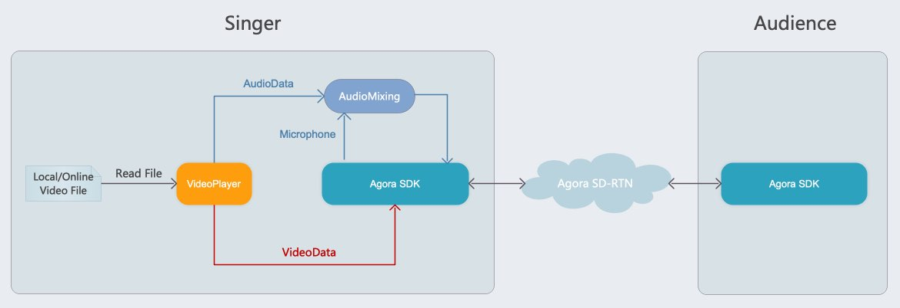
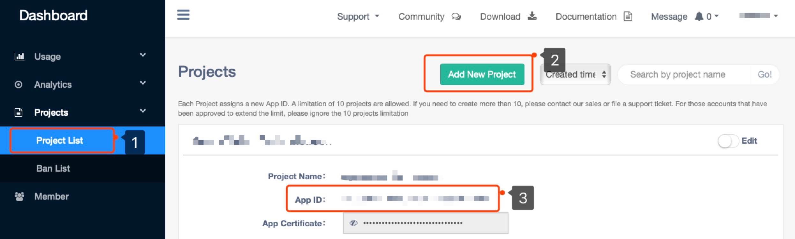
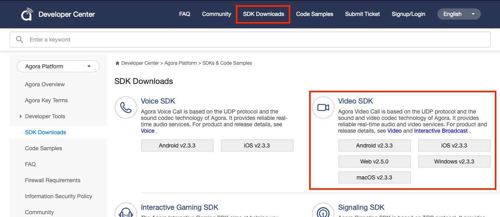
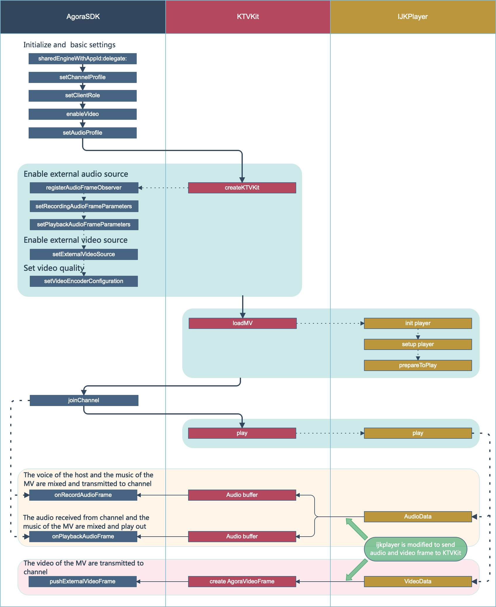

# Agora Online KTV

*Other language: [中文](README.zh.md)*

## Introduction

Users can create karaoke television (KTV) rooms to perform the following:

- Make voice or video calls with other users.
- Play music videos (MVs).
- Sing along with the MV.
- Adjust the volume of their own voice and the MV music.

## Architecture

Here is the architecture of the Agora Online KTV:



- The host (singer) plays local or online MV files.
- The voice of the host and the music of the MV are locally mixed by the Agora Native SDK for Video and transmitted to the Agora SD-RTN along with the MV video.
- The audience receives the mixed audio and the MV video through the Agora SD-RTN.

## Run the Sample App

1. Create a developer account at [agora.io](https://sso.agora.io/en/signup) and create a project in Dashboard to get the App ID.


2. Download the [Agora Native SDK for Voice/Video](https://docs.agora.io/en/Interactive%20Broadcast/downloads).


#### Android

1. Add the App ID in the `Android/Agora-Online-KTV/app/src/main/res/values/strings_config.xml` file of your project.

   ```
   <string name="agora_app_id"><#YOUR APP ID#></string>
   ```

2. Unpack the SDK and do the following:

   - Copy the `*.jar`  file under the `libs` folder and save it to the `Android/Agora-Online-KTV/app/libs` folder of your project.
   - Copy the `arm64-v8a/x86/armeabi-v7a` file under the `libs` folder and save it to the `Android/Agora-Online-KTV/app/src/main/jniLibs` folder of your project.

3. Open your project in Android Studio and connect to an Android test device. Compile and run the sample app. 

```
Development environment:
- Android SDK API Level 16+.
- Android Studio 3.1+.
- Devices with audio and video support.
- Android 4.1+.
```

#### iOS

1. Add the App ID in the `AgoraVideoViewController.m` file.

   ```
   self.rtcEngine = [AgoraRtcEngineKit sharedEngineWithAppId:<#APP_ID#> delegate:self];
   ```

2. Unpack the SDK and copy the `AgoraRtcEngineKit.framework` file to the `iOS/Agora-Online-KTV/Agora-Online-KTV` folder of your project.

3. Open `iOS/Agora-Online-KTV/Agora-Online-KTV.xcodeproj` in Xcode. Connect to an iOS test device, fill in a valid developer signature and run the sample app.

```
Development environment:
- Xcode 10.0+.
- iOS 8.0+.
```

## API methods



The API methods related to the Agora Online KTV feature can be divided into two categories.

### Join a Channel and Make Voice/Video Calls

- Creates an Agora RTC engine.
- [`enableVideo`](https://docs.agora.io/en/Interactive%20Broadcast/API%20Reference/oc/Classes/AgoraRtcEngineKit.html#//api/name/enableVideo): Enables the video mode.
- [`setVideoProfile`](https://docs.agora.io/en/Interactive%20Broadcast/API%20Reference/oc/Classes/AgoraRtcEngineKit.html#//api/name/setVideoProfile:swapWidthAndHeight:): Sets the video profile.
- [`setChannelProfile`](https://docs.agora.io/en/Interactive%20Broadcast/API%20Reference/oc/Classes/AgoraRtcEngineKit.html#//api/name/setChannelProfile:): Sets the channel profile.
- [`setClientRole`](https://docs.agora.io/en/Interactive%20Broadcast/API%20Reference/oc/Classes/AgoraRtcEngineKit.html#//api/name/setClientRole:):Sets the role of the user, such as a host or an audience (default).
- [`setupLocalVideo`](https://docs.agora.io/en/Interactive%20Broadcast/API%20Reference/oc/Classes/AgoraRtcEngineKit.html#//api/name/setupLocalVideo:): Sets the local video view.
- [`setupRemoteVideo`](https://docs.agora.io/en/Interactive%20Broadcast/API%20Reference/oc/Classes/AgoraRtcEngineKit.html#//api/name/setupRemoteVideo:): Sets the remote video view.
- [`joinChannel`](https://docs.agora.io/en/Interactive%20Broadcast/API%20Reference/oc/Classes/AgoraRtcEngineKit.html#//api/name/joinChannelByToken:channelId:info:uid:joinSuccess:): Allows a user to join a channel.
- [`leaveChannel`](https://docs.agora.io/en/Interactive%20Broadcast/API%20Reference/oc/Classes/AgoraRtcEngineKit.html#//api/name/leaveChannel:): Allows a user to leave the channel.
- [`stopPreview`](https://docs.agora.io/en/Interactive%20Broadcast/API%20Reference/oc/Classes/AgoraRtcEngineKit.html#//api/name/stopPreview): Stops the local video preview and the video.

### Play and Control MV Files

The following sample code abstracts a KTVKit class that controls the MV and pushes the video frames to the Agora SDK.

- `create`: Creates KTVKit and passes it to the Agora SDK.
- `openAndPlayVideoFile`: Opens and plays an MV file.
- `pause` or `resume`: Pauses or resumes playback.
- `stopPlayVideoFile`: Stops playback.
- `switchAudioTrack`: Switches between the instrumental and vocal version of a song.
- `resetAudioBuffer`: Resets the audio buffer. The SDK calls this method when the user role switches.
- `adjustVoiceVolume`: Adjusts the voice volume (%).
- `adjustAccompanyVolume`: Adjusts the music volume (%).
- `getCurrentPosition`: Gets the MV playback position (%).
- `getDuration`: Gets the MV playback duration (ms).

#### Advanced functions

1. To enable the in-ear monitoring function, see [In-ear Monitoring](https://docs.agora.io/en/Interactive%20Broadcast/in-ear_android?platform=Android).

## FAQ

[Online KTV FAQ](https://confluence.agora.io/display/CUS1/Online-KTV)

## Contact Us

- API documentation is available at the [Document Center](https://docs.agora.io/en/).
- For any issue with integration, connect with global developers in the [Developer Community](https://dev.agora.io/en/).
- For any question about purchasing our service, contact [sales-us@agora.io](mailto:sales-us@agora.io).
- For technical support, submit a ticket at [Dashboard](https://dashboard.agora.io).
- For any bug in our sample code, submit an issue at [GitHub](https://github.com/AgoraIO/Agora-Online-KTV/issues).

## License

The MIT License (MIT).
