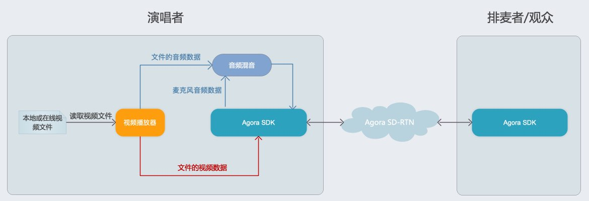
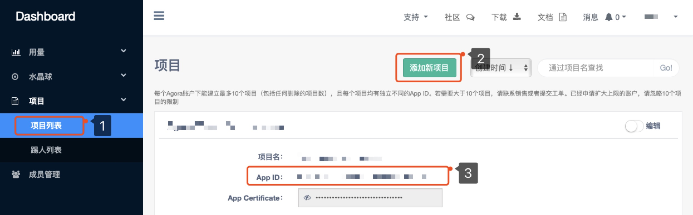
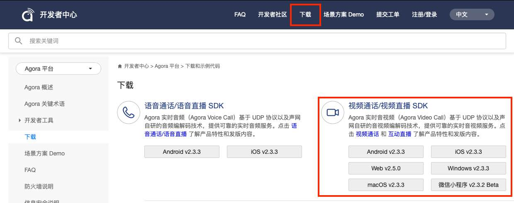
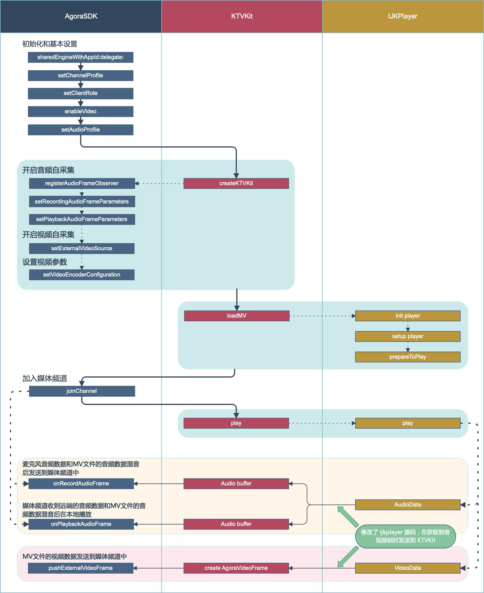

# Online KTV（一起 KTV）

*Other language: [English](README.md)*

## 场景描述

“一起KTV” 是一个依附于直播聊天室的娱乐场景。在这个场景中，一个KTV房间里的演唱者给其他人播放 MV 视频，并跟随 MV 唱歌给所有人听。其中：

1. 观众可以上麦，随时与房主进行实时音视频互动；
2. 演唱者随着 MV 唱歌时，可以控制歌曲的切换和暂停；
3. 演唱者也可以单独只播放 MV 文件；
4. 演唱者可以自己调节 MV 伴奏和人声的音量；
5. 观众可以排麦，当前演唱者结束后由下一位排麦中的人成为演唱者；

其中需要的功能有：

1. 基础的音视频互动直播，包括主播、互动连麦；
2. 本地/在线 MV 文件读取；
3. 将 MV 伴奏和视频发送给其他人；
4. 演唱者人声和 MV 伴奏音乐的混合；

## 架构设计

声网的“一起KTV”场景方案，提供了这个场景中实时音视频互动直播、MV 文件读取、人声和 MV 伴奏同步、音量控制、播放控制、发送 MV 伴奏和视频数据 等相关功能的解决方案。

整体架构如下图所示：



1. 演唱者和其他用户一起加入声网频道，实现实时音视频通话，其中当前演唱者和连麦者为主播模式，听众为观众模式；
2. 演唱者播放本地或者在线的 MV 文件；
3. MV 文件解码出来的音频帧数据，混音进声网 SDK 采集到的演唱者歌声，并通过声网 SDK 发送到频道中；
4. MV 文件解码出来的视频帧数据通过声网 SDK 发送到频道中；
5. 房间内的其他用户通过声网 SDK 接收演唱者的歌声和 MV 数据。

## 运行示例 Demo

1. 在 [Agora.io 用户注册页](https://dashboard.agora.io/cn/signup/) 注册账号，并创建自己的项目获取到 App ID。


2. 下载 Agora [视频通话／视频直播 SDK](https://docs.agora.io/cn/Interactive%20Broadcast/downloads)。


#### Android

1. 将有效的 App ID 填写进本项目的 `Agora-Online-KTV/app/src/main/res/values/strings_config.xml` 中。

    ```
    <string name="agora_app_id"><#YOUR APP ID#></string>
    ```

2. 解压下载到的 SDK 包，将其中的 `libs` 文件夹下的 `*.jar` 复制到本项目的 `Android/Agora-Online-KTV/app/libs` 下，其中的 `libs` 文件夹下的 `arm64-v8a/x86/armeabi-v7a` 复制到本项目的 `Android/Agora-Online-KTV/app/src/main/jniLibs` 下

3. 使用 Android Studio 打开该项目，连接 Android 测试设备，编译并运行。

```
运行环境:
* Android SDK API Level >= 16
* Android Studio 3.1 +
* Android 4.1 或以上支持语音和视频功能的真机设备
```

#### iOS
1. 将有效的 App ID 填写进 AgoraVideoViewController.m 中。

    ```
    self.rtcEngine = [AgoraRtcEngineKit sharedEngineWithAppId:<#APP_ID#> delegate:self];
    ```
2. 解压下载到的 SDK 包，将其中的 `AgoraRtcEngineKit.framework` 复制到本项目的 `Agora-Online-KTV/Agora-Online-KTV` 目录下。

3. 使用 Xcode 打开 `Agora-Online-KTV/Agora-Online-KTV.xcodeproj`，连接 iOS 测试设备，设置有效的开发者签名后即可运行。

```
运行环境:
​* Xcode 10.0 +
​* iOS 8.0 +
```

## API 列表

示例 App 的 API 流程如下图所示。其中 `KTVKit` 模块已经封装了在 KTV 场景下的声网引擎和 IJKPlayer 相关功能。



Agora SDK 关键 API 列表：

iOS|Android
---|---
[sharedEngineWithAppId:delegate:](https://docs.agora.io/cn/Interactive%20Broadcast/API%20Reference/oc/Classes/AgoraRtcEngineKit.html#//api/name/sharedEngineWithAppId:delegate:)|[create](https://docs.agora.io/cn/Interactive%20Broadcast/API%20Reference/java/classio_1_1agora_1_1rtc_1_1_rtc_engine.html#a35466f690d0a9332f24ea8280021d5ed)
[setChannelProfile](https://docs.agora.io/cn/Interactive%20Broadcast/API%20Reference/oc/Classes/AgoraRtcEngineKit.html#//api/name/setChannelProfile:)|[setChannelProfile](https://docs.agora.io/cn/Interactive%20Broadcast/API%20Reference/java/classio_1_1agora_1_1rtc_1_1_rtc_engine.html#a1bfb76eb4365b8b97648c3d1b69f2bd6)
[setClientRole](https://docs.agora.io/cn/Interactive%20Broadcast/API%20Reference/oc/Classes/AgoraRtcEngineKit.html#//api/name/setClientRole:)|[setClientRole](https://docs.agora.io/cn/Interactive%20Broadcast/API%20Reference/java/classio_1_1agora_1_1rtc_1_1_rtc_engine.html#aa2affa28a23d44d18b6889fba03f47ec)
[enableVideo](https://docs.agora.io/cn/Interactive%20Broadcast/API%20Reference/oc/Classes/AgoraRtcEngineKit.html#//api/name/enableVideo)|[enableVideo](https://docs.agora.io/cn/Interactive%20Broadcast/API%20Reference/java/classio_1_1agora_1_1rtc_1_1_rtc_engine.html#a99ae52334d3fa255dfcb384b78b91c52)
[setAudioProfile](https://docs.agora.io/cn/Interactive%20Broadcast/API%20Reference/oc/Classes/AgoraRtcEngineKit.html#//api/name/setAudioProfile:scenario:)|[setAudioProfile](https://docs.agora.io/cn/Interactive%20Broadcast/API%20Reference/java/classio_1_1agora_1_1rtc_1_1_rtc_engine.html#a34175b5e04c88d9dc6608b1f38c0275d)
[joinChannel](https://docs.agora.io/cn/Interactive%20Broadcast/API%20Reference/oc/Classes/AgoraRtcEngineKit.html#//api/name/joinChannelByToken:channelId:info:uid:joinSuccess:)|[joinChannel](https://docs.agora.io/cn/Interactive%20Broadcast/API%20Reference/java/classio_1_1agora_1_1rtc_1_1_rtc_engine.html#a8b308c9102c08cb8dafb4672af1a3b4c)
[onRecordAudioFrame](https://docs.agora.io/cn/Interactive%20Broadcast/API%20Reference/cpp/classagora_1_1media_1_1_i_audio_frame_observer.html#ac6ab0c792420daf929fed78f9d39f728)|[onRecordAudioFrame](https://docs.agora.io/cn/Interactive%20Broadcast/API%20Reference/cpp/classagora_1_1media_1_1_i_audio_frame_observer.html#ac6ab0c792420daf929fed78f9d39f728)
[onPlaybackAudioFrame](https://docs.agora.io/cn/Interactive%20Broadcast/API%20Reference/cpp/classagora_1_1media_1_1_i_audio_frame_observer.html#aefc7f9cb0d1fcbc787775588bc849bac)|[onPlaybackAudioFrame](https://docs.agora.io/cn/Interactive%20Broadcast/API%20Reference/cpp/classagora_1_1media_1_1_i_audio_frame_observer.html#aefc7f9cb0d1fcbc787775588bc849bac)
[pushExternalVideoFrame](https://docs.agora.io/cn/Interactive%20Broadcast/API%20Reference/oc/Classes/AgoraRtcEngineKit.html#//api/name/pushExternalVideoFrame:)|[pushExternalVideoFrame](https://docs.agora.io/cn/Interactive%20Broadcast/API%20Reference/java/classio_1_1agora_1_1rtc_1_1_rtc_engine.html#a6e7327f4449800a2c2ddc200eb2c0386)

## 集成方法

### 1. 集成声网 SDK 并实现互动直播功能

具体流程见声网 SDK 快速开始文档：

- [声网 SDK 快速开始 - iOS](https://docs.agora.io/cn/Interactive%20Broadcast/ios_video?platform=iOS) 
- [声网 SDK 快速开始 - Android](https://docs.agora.io/cn/Interactive%20Broadcast/android_video?platform=Android)

### 2. 实现 MV 文件音视频帧读取

使用 ijkplayer 等已经实现了完善的在线/本地 MV 文件读取和控制功能的第三方控件，获取到 MV 的音视频帧。

使用声网 SDK 的 [pushExternalVideoFrame](https://docs.agora.io/cn/Interactive%20Broadcast/API%20Reference/java/classio_1_1agora_1_1rtc_1_1_rtc_engine.html#a6e7327f4449800a2c2ddc200eb2c0386) 接口，将视频帧数据传入声网 SDK。

在 声网 SDK 的 [onRecordAudioFrame](https://docs.agora.io/cn/Interactive%20Broadcast/API%20Reference/cpp/classagora_1_1media_1_1_i_audio_frame_observer.html#ac6ab0c792420daf929fed78f9d39f728) C++ 回调中，将 MV 的音频帧数据和 声网 SDK 采集到的歌唱者音频帧数据混合起来，实现人声和伴奏的混音。具体可参看 Demo 中 KTVKit 内部的实现。

**你也可以直接使用 Demo 中的 `KTVKit` 类，该类已经将 MV 文件读取、混音、控制和传输都封装成简单的接口，方便调用。**

### 3. 进阶功能

1. 启用耳返功能，详见[耳返](https://docs.agora.io/cn/Interactive%20Broadcast/in-ear_android?platform=Android)。

## 注意事项

1. 开发者可以选择使用 demo 中封装好的 `KTVKit` 类以简化 MV 文件的读取和播放；
2. 为了能将读取到的音视频帧数据回调出来输入给声网 SDK，Demo 中集成的 `ijkplayer` 经过了必要的改造，不能替换成其他版本的 ijkplayer 库；
3. iOS Demo 中的 `ijkplayer` 为动态库，并包含了模拟器架构。在正式上传 Appstore 审核前需要手动将其中的模拟器架构去掉，避免影响审核；
4. `KTVKit` 必须在加入频道前进行初始化。如果需要在频道中启用 KTVKit，需要先离开当前频道；
5. `KTVKit` 类支持有一个或者两个音轨的 MV 文件，不支持第三根或者更多的音轨。如果 MV 文件有大于一根音轨，`KTVKit` 初始默认读取第二根音轨；
6. `KTVKit` 类目前只支持 `mp4` 格式的 MV 文件。

## 常见问题调查

常见问题整理：[一起 KTV FAQ](https://confluence.agora.io/pages/viewpage.action?pageId=629008768)

## 联系我们

- 完整的 API 文档见 [文档中心](https://docs.agora.io/cn/)。
- 如果在集成中遇到问题，你可以到 [开发者社区](https://dev.agora.io/cn/) 提问。
- 如果有售前咨询问题，可以拨打 400 632 6626，或加入官方 QQ 群 12742516 提问。
- 如果需要售后技术支持，你可以在 [Agora Dashboard](https://dashboard.agora.io) 提交工单。
- 如果发现了示例代码的 bug，欢迎提交 [issue](https://github.com/AgoraIO/Agora-Online-KTV/issues)。

## 代码许可

The MIT License (MIT).
