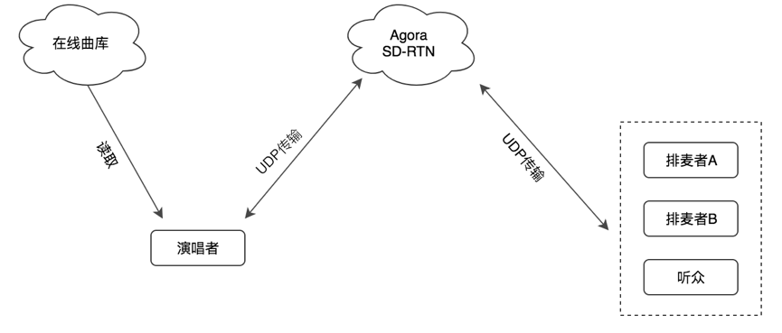
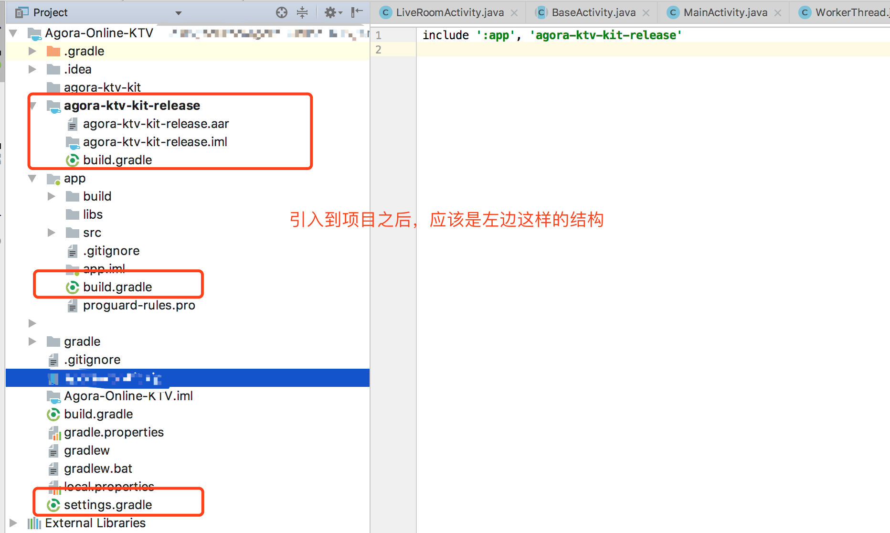

# Agora Online KTV(一起 KTV)

*其他语言：[English](README.md)*

### 场景描述
- 创建 KTV 房间，用户可以互相音视频沟通；
- 用户可以在 KTV 房间播放 MV 文件；
- 用户可以随着 MV 拿麦唱歌；
- 拿麦者可在演唱时自行调节 MV 伴奏与人声音量；


### 声网实现方案
下图为一起 KTV 场景的声网实现架构图：



在这个实现架构图中：

- 拿麦者播放本地或者在线 MV 歌曲；
- 拿麦者的歌声与 MV 伴奏通过 Agora Video SDK 在本地经过混音、编码，基于私有 UDP 协议传输至 Agora SD-RTN；
- MV 视频内容通过 Agora Video SDK 传输至 Agora SD-RTN；
- Agora SD-RTN 通过私有 UDP 协议将拿麦者的歌声与 MV 画面传输给其他用户；


### 集成方法
#### Android
##### [Android 示例代码](Android/Agora-Online-KTV)
##### 集成 SDK

##### 步骤 1：准备环境
下载 Android 平台 视频通话／视频直播 SDK 。

请确保满足以下开发环境要求:

Android SDK API Level >= 16

Android Studio 3.1 或以上版本

支持语音和视频功能的真机

App 要求 Android 4.1 或以上设备

请确保在使用 Agora 相关功能及服务前，已打开特定端口，详见 [防火墙说明](https://docs.agora.io/cn/2.3.1/product/Interactive%20Broadcast/Agora%20Platform/firewall)。

##### 步骤 2: 添加 SDK
```
如果当前项目中已经以其他方式集成了 Agora Video SDK，请先找工作人员是否需要替换当前已有的版本
```

将 [agora-ktv-kit-release](Android/Agora-Online-KTV/agora-ktv-kit-release) 文件夹整个目录拷贝至您的项目的根目录里面(需要 Android Studio 或者 Gradle 构建的项目，如果您使用的是 Eclipse 或者 Ant 构建的项目，可以参照网上的做法或者寻求我们开发人员的帮助)。

在项目根目录的 settings.gradle 里面引入 agora-ktv-kit-release，类似如下

```
include ':app', 'agora-ktv-kit-release'
```
在项目应用目录的 build.gradle 里面引入 agora-ktv-kit-release，类似如下

```
implementation project(':agora-ktv-kit-release')
```

完成以后如下：



##### 步骤 3: 配置 NDK(如果只想使用本项目的 KTV 功能，不依赖 NDK)
如果出现以下问题，请配置 NDK:

该错误表示没有安装 NDK。请从网站上下载，请将其放在与 Android SDK 平行的路径下:


##### 步骤 4: 添加权限
为保证 SDK 正常运行，程序部署时需在 AndroidManisfest.xml 文件中加入以下许可：

```
<uses-permission android:name="android.permission.INTERNET" />

<uses-permission android:name="android.permission.RECORD_AUDIO" />

<uses-permission android:name="android.permission.MODIFY_AUDIO_SETTINGS" />

<uses-permission android:name="android.permission.ACCESS_NETWORK_STATE" />
```

##### 步骤 5：同步项目文件
点击 Sync Project With Gradle Files ，直到同步完成。


##### 步骤 6：混淆代码
当您在写混淆代码时，请添加以下代码:

```
-keep class io.agora.** { *; }
```

##### 关键代码导读，一起 KTV 实际上由两大部分功能组成
##### 加入声网频道实现音视频通话(歌声被远端观众听到)

申请 App ID，详见 获取 App ID。

创建 RtcEngine 对象，并填入 App ID，详见 创建 RtcEngine 对象 (create)

设置频道为直播模式，详见 设置频道属性 (setChannelProfile)

启用视频模式，详见 打开视频模式 (enableVideo)

设置本地视频视图，详见 设置本地视频显示属性 (setupLocalVideo)

设置远端视频视图，详见 设置远端视频显示属性 (setupRemoteVideo)

设置视频分辨率, 详见 设置视频属性 (setVideoProfile)

设置用户角色，详见 设置用户角色 (setClientRole)

拿麦者：BROADCASTER

观众：AUDIENCE

创建并加入频道, 详见 加入频道 (joinChannel)

离开频道 (leaveChannel)，详见 离开频道 (leaveChannel)

停止视频预览 (stopPreview)，详见 停止视频预览 (stopPreview)

##### MV 文件播放控制(完成 KTV 相关动作，比如切歌，原音/伴奏切换)
创建 KTVKit 对象，详见 创建 KTVKit 对象 (create)。

KTVKit 提供的基础功能需要包括：

打开并播放文件 (openAndPlayVideoFile)

暂停/播放 (pause/resume)

停止 (stopPlayVideoFile)

切音轨/切伴奏以及原音 (switchAudioTrack)

重置音频缓冲区，切换拿麦者/观众时候调用 (resetAudioBuffer)

调整人声大小，百分比参数 (adjustVoiceVolume)

调整伴奏大小，百分比参数 (adjustAccompanyVolume)

获取当前 MTV 播放位置，以百分比返回 (getCurrentPosition)

获取 MTV 总长度，以毫秒为单位返回 (getDuration)

##### 进阶
耳返接口:

启用耳返功能，详见 启用耳返监听 (enableInEarMonitoring) 。

设置耳返音量，相见 设置耳返音量 (setInEarMonitoringVolume) 。


#### iOS(TODO)


## 联系我们

- 完整的 API 文档见 [文档中心](https://docs.agora.io/cn/)
- 如果在集成中遇到问题，你可以到 [开发者社区](https://dev.agora.io/cn/) 提问
- 如果有售前咨询问题，可以拨打 400 632 6626，或加入官方Q群 12742516 提问
- 如果需要售后技术支持，你可以在 [Agora Dashboard](https://dashboard.agora.io) 提交工单
- 如果发现了示例代码的bug，欢迎提交 [issue](https://github.com/AgoraIO/Agora-Online-KTV/issues)

## 代码许可

The MIT License (MIT).
